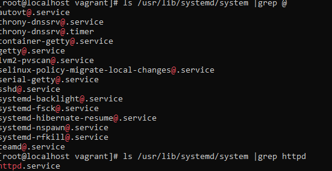
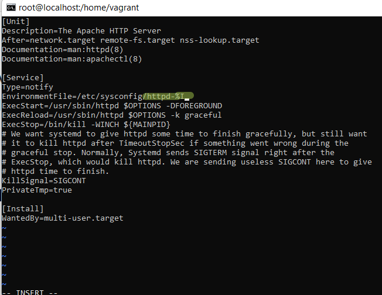
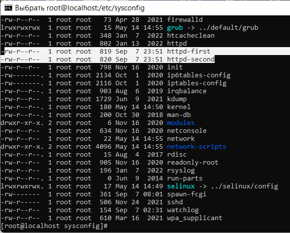
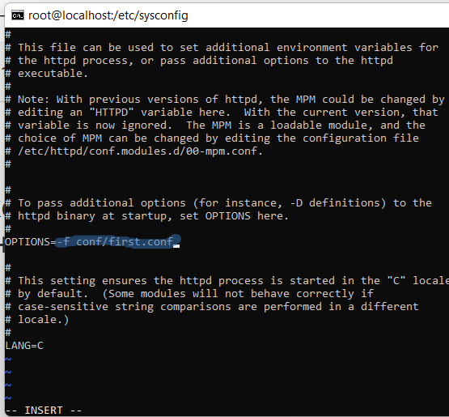
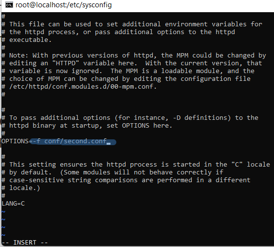
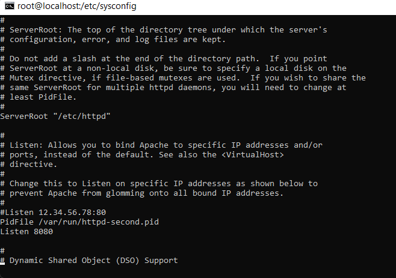
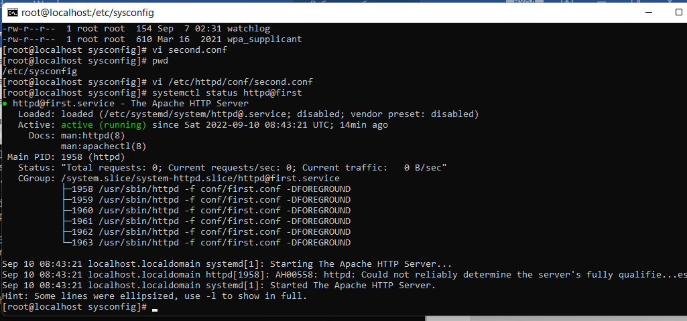
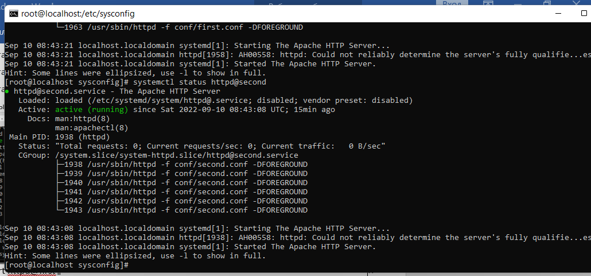

# **Systemd**
___________________________________________
## **Создание сервиса мониторинга**
___________________________________________
1. Размещаем конфиг **watchlog** в директорию /etc/default со значением переменных:
   - $WORD - устанавливается слова для поиска. В данной работе "Alert"
   - $LOG - полное имя лога, в котором будет произодиться поиск (/var/log/watchlog.log).
2. Размещаем **watchlog.log** в директорию /var/log.
3. Размещаем скрипт [watchlog.sh](ansible/roles/my_service/files/opt/watchlog.sh) в директорию /opt, который при нахождении эталонного слова в заданном логе с помощью команды **logger** помещает сообщение в системный лог.
4. Создаем Unit-service systemd [watchlog.service](ansible/roles/my_service/files/etc/systemd/system/watchlog.service),
который передает параметры из [/etc/default/watchlog](ansible/roles/my_service/files/etc/default/watchlog)
в скрипт [watchlog.sh](ansible/roles/my_service/files/opt/watchlog.sh) и запускает его.
5. Создаем Unit-timer systemd [watchlog.timer](ansible/roles/my_service/files/etc/systemd/system/watchlog.timer),
который каждый 30 секунд после первого запуска будет запускать watchlog.service.
При совпадении имен таймер сам будет искать необходимый сервис, если он был запущен хотя бы один раз.
6. После размещения новых Unit в директорию /etc/systemd/system Необходимо перезапустить systemd  
                  **sudo systemctl daemon-reload**
7. Разово запустим сервис watchlog, а затем запускаем одноименный таймер.
8. Проверим работу системы мониторинга: 
              **tail -n /var/log/syslog | grep word** 
_____________________________________________________________________
## **Установить spawn-fcgi и создать unit-файл (spawn-fcgi.sevice) с помощью переделки init-скрипта**
_____________________________________________________________________
1. Устанавливаем spawn-fcgi и необходимые для него пакеты, заодно и nginx для следующего этапа 
([список пакетов - install_pkgs](ansible/roles/my_service/vars/main.yml)
2. Инит файл [[https://gist.github.com/cea2k/1318020](https://gist.github.com/cea2k/1318020 )
3. Размещаем конфиг [fcgi.conf](ansible/roles/my_service/files/etc/spawn-fcgi/fcgi.conf) в директорию /etc/spawn-fcgi
3. Создаем Unit-service systemd [spawn-fcgi.service](ansible/roles/my_service/files/etc/systemd/system/spawn-fcgi.service).
 в директории /etc/systemd/system
4. После размещения новых Unit в директорию /etc/systemd/system Необходимо перезапустить systemd  
                  **sudo systemctl daemon-reload**
5. Запускаем созданный сервис и проверяем его статус  
    **sudo systemctl start spawn-fcgi.service**
    **sudo systemctl status spawn-fcgi.service**
______________________________________________
## **Одновременный запуск сервиса httpd с разными конфигами**
______________________________________________
1. Найдем местоположение файла httpd.service. 
 

2. Скопируем httpd.service как шаблон в каталог /etc/systemd/system: 
**cp /usr/lib/systemd/system/httpd.service /etc/systemd/system/httpd@.service** 

3.  Добавим имя экземпляра  в шаблоне %I: 
 **vi /etc/systemd/system/httpd\@.service** 
 

4.  Создаем два файла окружения в директории, копируя файл /etc/sysconfig/httpd:httpd-first и httpd-second: 

5. В файлазх окружения задаетсā опция для запуска веб-сервера с необходимым конфигурационным файлом.  
 

6. Переходим в директорию с конфигами httpd: /etc/httpd/cong/. 
Копируем оригинальный конфиг httpd.conf под именами  first.conf и second.conf.  
Внесем изменения только в second.conf.  
Добавим строчку PidFile /var/run/httpd-second.pid и Изменим порт для прослушивания на 8080 : Listen 8080.  
 
7. Запустим сервис httpd с разными конфигурационными файлами: 
 
 
____________________________________________
## **Вывод**
В данной работе рассмотрели создание юнитов systemd, их запуска. Рассмотрели способ одновременного запуска сервиса с разными конфигурационными файлами.
_____________________________________________
Файл Vagrant подзагружает box из облака, в котором уже есть сервис мониторинга. его только нужно запустить.
Настроен httpd сервис для запуска с разными конфигурациями.

